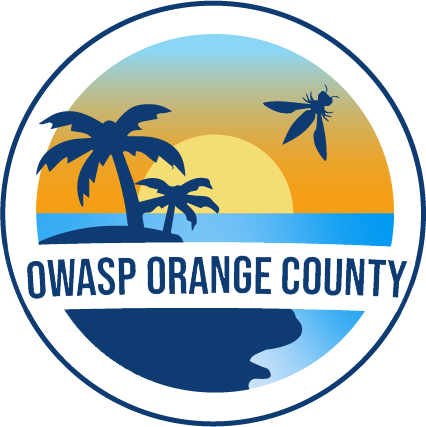
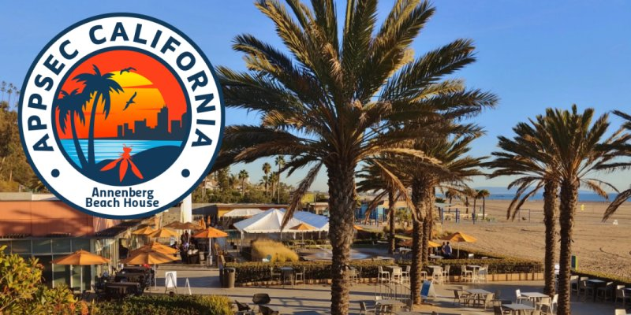

---

layout: col-sidebar
title: OWASP Orange County
tags: chapter
level: 0

region: United States

---

Welcome to the Orange County chapter homepage.

The Orange County OWASP Chapter uses a community building website known as "meetup", click the logo below to find out more about our chapter. Join the meetup group to be notified of future OWASP OC events.

 

## Participation
The Open Web Application Security Project (OWASP) is a nonprofit foundation that works to improve the security of software. All of our projects, tools, documents, forums, and chapters are free and open to anyone interested in improving application security. 

Chapters are led by local leaders in accordance with the [Chapter Leader Handbook](/www-policy/operational/chapter-handbook-existing.html). Financial contributions should only be made online using the authorized online donation button. To be a SPEAKER at ANY OWASP Chapter in the world simply review the [speaker agreement](/www-policy/legal/speaker-agreement.html) and then contact the local chapter leader with details of what OWASP Project, independent research, or related software security topic you would like to present.

Everyone is welcome and encouraged to participate in our [Projects](/projects), [Local Chapters](/chapters), [Events](/events), [Online Groups](https://groups.google.com/a/owasp.com/){:target='_blank'}, and [Community Slack Channel](https://owasp.slack.com/){:target='_blank'}. We especially encourage diversity in all our initiatives. OWASP is a fantastic place to learn about application security, to network, and even to build your reputation as an expert. We also encourage you to be [become a member](/membership) or consider a [donation](/donate) to support our ongoing work.

## AppSec California
OWASP Orange County, alongside other local chapters, participate in the organization of [AppSec California](https://appseccalifornia.org){:target="_blank"} held each year in Santa Monica.

{:target="_blank"}

## Chapter Members Recognition

The Orange County Chapter would like to recognize the following
individuals for their help into our endeavors such as AppSec California
and special outreach events:

  - Vladimir Restivo
  - Angela Young
  - Adam Brand
  - Pauline Ang
  - Mehmet Yilmaz
  - Nick Santucci
  - Robert Cohen
  - Rushabh Dalwadi
  - Kenneth Yee
  - TJ
  - Steven Millett
  - Susan Huang
  - Linus Yue
  - Dmitry Sotnikov
  - Lori Barfield

