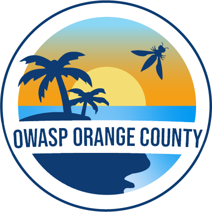
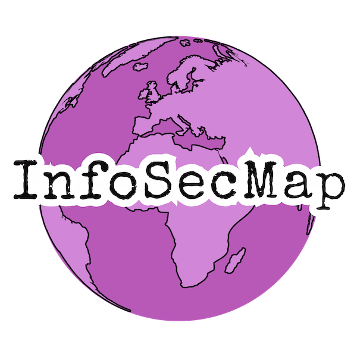

---

layout: col-sidebar
title: OWASP Orange County
tags: chapter
level: 0

region: North America
meetup-group: OWASP-OC
country: USA
postal-code: 92618

---

 
 

Welcome to the Orange County chapter homepage.

The OWASP Orange County Chapter brings together security professionals, developers, students, researchers, and community members interested in application security, API security, AI security, cloud security, and secure software development. It has been active for several years and is a welcoming community for anyone interested in application security. The OC Chapter organizes events and meetings that can be found on their meetup page, where people can join to stay updated. Participation is open to everyone, and local leaders guide the chapter’s activities. The OC chapter encourages diversity and offers opportunities for learning, networking, and building a reputation in the field.

### Check our Upcoming Events:
All of our meetings and meeting details can be found on Eventbrite page.
Please visit [Eventbrite - OWASP OC](https://www.eventbrite.com/o/owasp-orange-county-120900036333) to view our past meetings and RSVP for our upcoming meetings.



## Community Sponsor

{:target="_blank"}

[InfoSecMap](https://infosecmap.com/){:target="_blank"} is your global go-to platform to explore the cybersecurity ecosystem. Discover conferences, CTFs, meetups, podcasts, and more, plus opportunities like call for papers, sponsors, and volunteers. Always community-first and free to use.

## Participation
The Open Web Application Security Project (OWASP) is a nonprofit foundation that works to improve the security of software. All of our projects, tools, documents, forums, and chapters are free and open to anyone interested in improving application security. 

Chapters are led by local leaders in accordance with the [Chapter Policy](https://owasp.org/www-policy/). Financial contributions should only be made online using the authorized online donation button. To be a SPEAKER at ANY OWASP Chapter in the world simply review the [speaker agreement](/www-policy/legal/speaker-agreement.html) and then contact the local chapter leader with details of what OWASP Project, independent research, or related software security topic you would like to present.

Everyone is welcome and encouraged to participate in our [Projects](/projects), [Local Chapters](/chapters), [Events](/events), [Online Groups](https://groups.google.com/a/owasp.com/){:target='_blank'}, and [Community Slack Channel](https://owasp.slack.com/){:target='_blank'}. We especially encourage diversity in all our initiatives. OWASP is a fantastic place to learn about application security, to network, and even to build your reputation as an expert. We also encourage you to be [become a member](/membership) or consider a [donation](/donate) to support our ongoing work.
